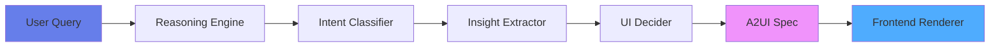

<div align="center">

# 🌌 AGUI

### *Autonomous Agentic Product Intelligence*

**UIs that assemble themselves**

[](https://python.org)
[](https://fastapi.tiangolo.com)
[](#)
[](#)

</div>

---

## 💡 What is AGUI?

An AI agent that **thinks in interfaces**. You speak naturally, it builds dashboards autonomously.

> **No hardcoded UI. No templates. Pure intelligence.**

```
"Show my GitHub activity" → 🧠 → 📊 Self-Assembling Dashboard
```

---

## 🎯 Core Philosophy

| Principle | Meaning |
|-----------|---------|
| 🧠 **Agent Decides** | UI composition is determined by intelligence, not code |
| 📡 **Event-Driven** | All communication via AG-UI protocol |
| 🎨 **Frontend = Renderer** | No business logic in UI layer |
| 🔮 **Adaptive** | Same query, different context → different dashboard |

---

## ⚡ Quick Start

### 📦 Installation

```bash
cd anti-gravity-agent
pip install -r requirements.txt
```

### 🚀 Launch

```bash
python -m uvicorn app.main:app --reload
```

Server runs at → `http://localhost:8000`

### 🎮 Test It

**PowerShell:**
```powershell
Invoke-RestMethod -Uri http://localhost:8000/agent/stream `
  -Method Post -ContentType "application/json" `
  -Body '{"query": "Show my GitHub activity"}'
```

**Curl:**
```bash
curl -X POST http://localhost:8000/agent/stream \
  -H "Content-Type: application/json" \
  -d '{"query": "Show my GitHub activity"}'
```

---

## 🏗️ Architecture



### 🧩 Components

| Component | File | Purpose |
|-----------|------|---------|
| 🎯 **Agent Runtime** | `app/main.py` | FastAPI + SSE streaming |
| 🧠 **Reasoning Engine** | `app/agent/brain.py` | Intent → Insights |
| 🎨 **UI Decider** | `app/agent/ui_decider.py` | Insights → Components |
| 📋 **AG-UI Events** | `app/schemas/events.py` | Protocol schemas |
| 🎛️ **A2UI Components** | `app/schemas/a2ui.py` | UI specification |

---

## 📡 AG-UI Protocol

**Agent communicates via 5 event types:**

| Event | Emoji | Purpose |
|-------|-------|---------|
| `agent.loading` | ⏳ | Processing state |
| `agent.message` | 💬 | Summary/explanation |
| `ui.render` | 🎨 | Full dashboard spec |
| `ui.update` | 🔄 | Partial UI change |
| `agent.error` | ❌ | Error reporting |

### 📨 Event Stream Example

```json
data: {"type":"agent.loading","payload":{"message":"Analyzing..."}}
data: {"type":"agent.message","payload":{"text":"Found 3 key metrics"}}
data: {"type":"ui.render","payload":{"type":"dashboard",...}}
```

---

## 🎨 A2UI Specification

**Agent-to-UI language for self-assembling dashboards**

### 🧩 Component Library

```
📊 dashboard    → Root container
📦 section      → Group related items
🔲 grid         → Layout manager
💎 card         → KPI display
📈 lineChart    → Trends over time
📊 barChart     → Comparisons
🥧 pieChart     → Distributions
📋 table        → Ranked data
📝 text         → Labels
➖ divider      → Visual separator
```

### 🎯 Intelligence Mapping

```
Agent Insight      →  UI Component
━━━━━━━━━━━━━━━━━━━━━━━━━━━━━━━━━
Totals            →  💎 KPI Cards
Trends            →  📈 Line Charts
Rankings          →  📋 Tables
Distribution      →  🥧 Pie Charts
Comparisons       →  📊 Bar Charts
```

---

## 🧠 Reasoning Pipeline

Every query flows through:

```
1️⃣ Intent Classification
   ↓
2️⃣ Data Planning
   ↓
3️⃣ Insight Extraction
   ↓
4️⃣ UI Decision
   ↓
5️⃣ A2UI Emission
```

### 🎯 Intent Types

- 🔍 **Overview** - Complete picture
- 📈 **Trend** - Changes over time
- ⚖️ **Comparison** - Side-by-side analysis
- ⭐ **Highlight** - Best performers
- 🔬 **Deep Dive** - Detailed breakdown

---

## 🎪 Live Example

**Input:**
```json
{"query": "Show my GitHub activity"}
```

**Output:**
```json
{
  "type": "dashboard",
  "title": "GitHub Activity Overview",
  "children": [
    {
      "type": "grid",
      "columns": 3,
      "children": [
        {"type": "card", "title": "Total Commits", "value": 312},
        {"type": "card", "title": "Repositories", "value": 18},
        {"type": "card", "title": "Top Language", "value": "Python"}
      ]
    },
    {"type": "lineChart", "title": "Commits Over Time", "data": [...]},
    {"type": "pieChart", "title": "Language Distribution", "data": [...]},
    {"type": "table", "title": "Top Repositories", "data": [...]}
  ]
}
```

**Agent Decided:**
- ✅ 3 KPI cards (found totals)
- ✅ Line chart (detected trend)
- ✅ Pie chart (found distribution)
- ✅ Table (identified rankings)

---

## 📁 Project Structure

```
anti-gravity-agent/
├── 📱 app/
│   ├── 🚀 main.py           # FastAPI server
│   ├── ⚙️ config.py         # Settings
│   ├── 🧠 agent/
│   │   ├── brain.py         # Reasoning engine
│   │   ├── ui_decider.py    # Component mapper
│   │   └── events.py        # Event helpers
│   └── 📋 schemas/
│       ├── events.py        # AG-UI protocol
│       └── a2ui.py          # Component specs
├── 📦 requirements.txt
└── 📖 README.md
```

---

## ⚙️ Configuration

Create `.env` for custom settings:

```env
DEBUG=true
CORS_ORIGINS=["http://localhost:3000"]
STREAM_DELAY=0.1
```

---

## 🔌 API Reference

### `POST /agent/stream`

Stream AG-UI events for a natural language query.

**Request:**
```json
{"query": "string"}
```

**Response:**  
Server-Sent Events with AG-UI protocol

---

### `GET /health`

Health check endpoint

**Response:**
```json
{"status": "healthy", "service": "AGUI Agent"}
```

---

### `GET /`

Service information

**Response:**
```json
{
  "service": "AGUI Agent",
  "version": "0.1.0",
  "protocol": "AG-UI",
  "specification": "A2UI"
}
```

---

## ✅ Phase 1 Status

- [x] 🎯 FastAPI server with SSE streaming
- [x] 🧠 Intent classification engine
- [x] 💡 Insight extraction (hardcoded data)
- [x] 🎨 UI decision logic
- [x] 📋 A2UI specification output

---

## 🚀 What's Next?

| Phase | Description |
|-------|-------------|
| **Phase 2** | 🎨 Frontend renderer (React/Next.js) |
| **Phase 3** | 📊 Real data integration (GitHub API) |
| **Phase 4** | 🤖 LLM-powered reasoning |
| **Phase 5** | 🌐 Multi-source dashboards |

---

## 🎯 Design Principles

```
✨ UI is decided by intelligence, not hardcoded
🎨 Frontend is only a renderer
🧠 All business logic lives in the agent
📡 Communication via events only
🚫 No JSX, HTML, or CSS from agent
```

---

<div align="center">

### 🌟 Built with Intelligence

**AGUI** - *Where dashboards assemble themselves*

[Documentation](#) • [Examples](#) • [API Reference](#api-reference)

</div>
